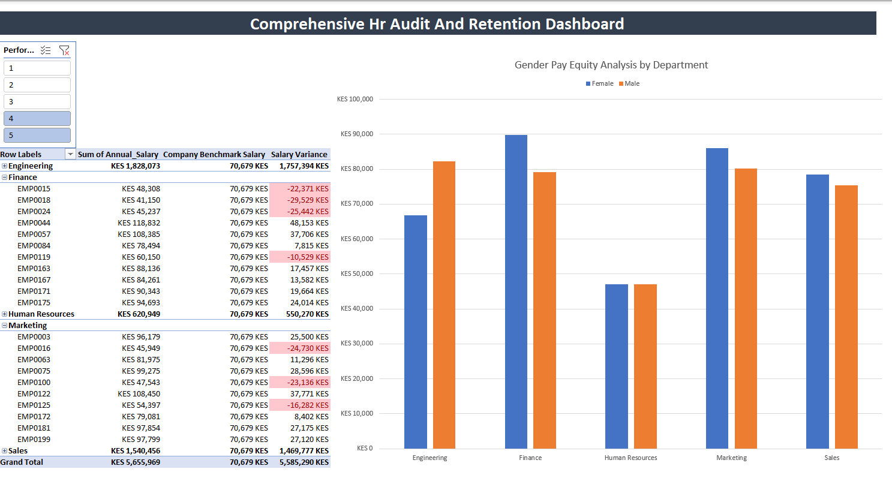

# Comprehensive HR Salary Audit & Retention Analytics

## Overview
This data analytics project acts as a functional HR dashboard designed to audit employee compensation, ensure internal pay equity, and identify high-value flight risks. The project processes raw HR datasets using advanced data modeling techniques to deliver instant, executive-level insights.

## Project Dashboard

## Tools & Techniques Used
* **Power Query:** Extracted, cleaned, and transformed raw departmental and compensation data.
* **Data Modeling:** Established relational connections between queries to power a unified dashboard engine.
* **DAX / Formulas:** Engineered custom measures, including a dynamic Company Benchmark Salary and a Salary Variance metric.
* **Data Visualization:** Built automated, slicer-controlled PivotTables, Clustered Column Charts, and conditional formatting to highlight critical HR risks.

## Key Business Questions Answered

### 1. Retention Matrix: Are top-performing employees at risk of leaving due to below-market compensation?
* **Solution:** Engineered a flight-risk trap that isolates employees with a performance rating of 4 or 5 and automatically flags those earning below the company benchmark in red, allowing HR to proactively adjust compensation.

### 2. Pay Equity & Compliance: Is there a gender pay gap across internal departments?
* **Solution:** Deployed an unfiltered departmental analysis revealing average compensation by gender. Visualized the findings to expose a significant pay disparity within the Engineering department (KES 15,430 gap favoring male employees), prompting immediate compliance review.

## Value Proposition
This dashboard moves HR from reactive reporting to proactive strategy, empowering decision-makers to retain critical talent and ensure fair, equitable compensation practices across the organization.
